# Automating a Cisco UCS FlexPod Foundation for Broadcom VCF + NetApp ASA A30

*Tags: Cisco UCS, NetApp FlexPod, PowerShell, VMware Cloud Foundation, Broadcom VCF, Fibre Channel*

---

## This Is a FlexPod Validated Design

Before we get into the configuration, a note on what this actually is: **NetApp FlexPod**
is a jointly engineered, tested, and validated data-center architecture built on
[Cisco UCS](https://www.cisco.com/c/en/us/products/servers-unified-computing/index.html),
[Cisco Nexus networking](https://www.cisco.com/c/en/us/products/switches/data-center-switches/index.html),
and [NetApp ONTAP storage](https://www.netapp.com/data-storage/ontap/). When this hardware
was new, the exact bill-of-materials and software stack in this guide carried a Cisco
Validated Design (CVD) designation, meaning it was tested end-to-end by engineers at all
three vendors and published as a supported reference architecture.

The hardware here — UCS 6300-series FIs, UCS 5108 chassis, B200-M4/M5 blades, and
**NetApp ASA A30** all-flash array — is no longer current-generation, but
**we are still following all FlexPod best practices** for pool sizing, naming, VSAN layout,
policy structure, and boot configuration. If you're deploying a fresh FlexPod on current
hardware, the patterns here translate directly to modern UCS X-Series + NetApp AFF/ASA A-Series
+ Broadcom VCF builds.

### The Vendors You Should Know

| Vendor | What They Bring | Resources |
|---|---|---|
| **Cisco** | UCS Fabric Interconnects, chassis, blade servers, UCS Manager | [cisco.com/go/ucs](https://www.cisco.com/c/en/us/products/servers-unified-computing/index.html) · [FlexPod CVDs](https://www.cisco.com/c/en/us/solutions/design-zone/networking-design-guides/flexpod.html) |
| **NetApp** | ASA A30 all-flash block storage, ONTAP OS, FlexPod co-engineering | [netapp.com/flexpod](https://www.netapp.com/data-storage/flexpod/) · [ASA A-Series](https://www.netapp.com/data-storage/asa/) |
| **Broadcom (VMware)** | Cloud Foundation (VCF), NSX-T, vSphere, vSAN | [broadcom.com/vmware](https://www.broadcom.com/products/software/vmware) · [VCF docs](https://docs.vmware.com/en/VMware-Cloud-Foundation/index.html) |

FlexPod CVDs are published jointly at
[netapp.com/flexpod](https://www.netapp.com/data-storage/flexpod/) and
[cisco.com FlexPod Design Zone](https://www.cisco.com/c/en/us/solutions/design-zone/networking-design-guides/flexpod.html).
If you're building green-field, start there before customizing anything.

---

## What We're Building

Eight B200 blades across a UCS 5108 chassis, dual 6300-series Fabric Interconnects, a
NetApp ASA A30 direct-attached via Fibre Channel, and [Broadcom VMware Cloud Foundation](https://www.broadcom.com/products/software/vmware)
as the hypervisor layer. The UCS side is scoped to a **HumbledGeeks sub-org** — isolated
from any other tenants on the shared domain.

**Key design constraint: MTU 1500 everywhere.** Block storage runs over Fibre Channel
vHBAs — none of the Ethernet vNICs carry storage traffic. With no iSCSI or NFS on the
Ethernet path, jumbo frames aren't needed and MTU 1500 avoids any fragmentation risk if a
switch in the path isn't uniformly jumbo-enabled.

A follow-up post covers the VCF 4+4 management/workload domain deployment on top of this
foundation.

---

## The Hardware

| Component | Detail |
|---|---|
| Fabric Interconnects | 2× Cisco UCS 6300 Series |
| Chassis | 1× UCS 5108 |
| Blades | 1× B200-M5 (slot 1/1), 7× B200-M4 (slots 1/2–1/8) |
| Storage | NetApp ASA A30 (FC direct attach to FI storage ports 29–32) |
| Hypervisor | Broadcom VMware Cloud Foundation 5.x |

### Cabling

FI-A and FI-B connect to each other on ports L1/L2 for cluster heartbeat. Each FI connects
to both IOM modules in the chassis (ports 1/1 and 1/2 per chassis, twin-ax SFP-H10GB).
Northbound Ethernet uplinks go to upstream Nexus switches; FC storage ports 29–32 connect
directly to the ASA A30 target ports.

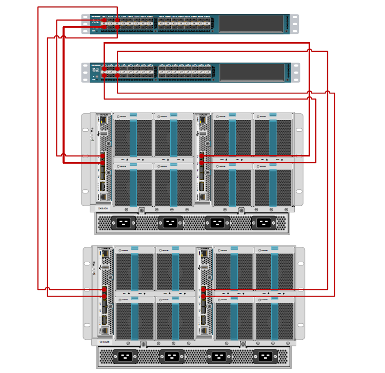

---

## Fabric Interconnect Initial Setup

Before software config, each FI is initialized via console (9600 8N1). FI-A is set up
first — when FI-B powers on and the L1/L2 cluster links are connected, it detects FI-A and
auto-joins the cluster.

```
# FI-A serial wizard key answers
Install method:        Console
Setup Mode:            Setup
Create new cluster:    y
Switch fabric:         A
System name:           hg-ucs-fi-a
Mgmt0 IPv4 address:    10.x.x.x
Mgmt0 IPv4 netmask:    255.255.255.0
Default gateway:       10.x.x.x
Cluster IP:            10.x.x.x   ← virtual IP for UCSM
```

After initial setup, use the UCSM port configuration wizard to split the fixed-module ports
between Ethernet and FC. The slider sets the boundary — ports left of it are Ethernet,
ports right are FC. Pull it so ports 29–32 become FC on both FIs.

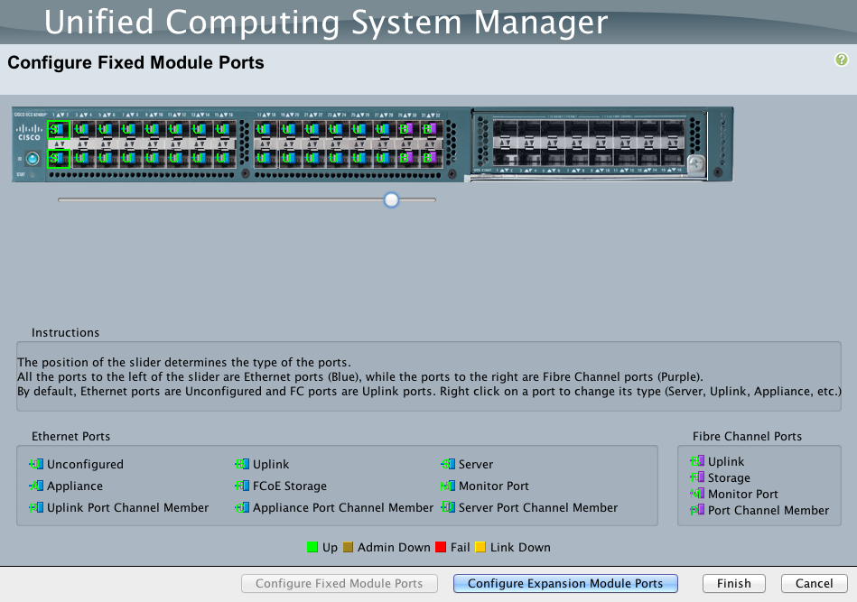

> **Note:** Changing the FC port boundary causes the FI to reboot immediately.
> Do this before chassis discovery so blades don't lose connectivity mid-association.

After reboot, acknowledge each chassis in the Equipment tab to trigger discovery.

---

## Network Design

### Ethernet — 6 vNICs, MTU 1500

| vNIC Pair | Fabric | MTU | Purpose |
|---|---|---|---|
| vmnic0 / vmnic1 | A / B | 1500 | ESXi management (vmk0) + vMotion (vmk1) |
| vmnic2 / vmnic3 | A / B | 1500 | VM workloads trunk — apps, core, Docker, GNS3 |
| vmnic4 / vmnic5 | A / B | 1500 | VCF overlay / NSX TEP (dedicated path) |

Separating NSX TEP traffic onto vmnic4/5 keeps Geneve-encapsulated overlay frames off the
VM workload path and simplifies NSX transport zone configuration. All at MTU 1500.

### FC Storage — Direct Attach to ASA A30

| vHBA | Fabric | WWPN Pool | VSAN | ID |
|---|---|---|---|---|
| vmhba0 | A | hg-wwpn-a | hg-vsan-a | 10 |
| vmhba1 | B | hg-wwpn-b | hg-vsan-b | 11 |

> All scripts are in the [HumbledGeeks infra-automation repo](https://github.com/humbledgeeks/infra-automation)
> under `Cisco/UCS/PowerShell/HumbledGeeks/`. Each section below links directly.

---

## Step 0 — Prerequisites and Connect

**Full script →** [`00-prereqs-and-connect.ps1`](https://github.com/humbledgeeks/infra-automation/blob/main/Cisco/UCS/PowerShell/HumbledGeeks/00-prereqs-and-connect.ps1)

Every other script dot-sources this one. Run any section standalone without re-authenticating.

```powershell
if (-not (Get-Module -ListAvailable -Name Cisco.UCS)) {
    Install-Module Cisco.UCS -Scope CurrentUser -Force
}
Import-Module Cisco.UCS -ErrorAction Stop

$global:UcsHandle = Connect-Ucs -Name '10.x.x.x' -Credential (Get-Credential)
$global:HgOrg     = Get-UcsOrg -Ucs $global:UcsHandle -Name 'HumbledGeeks' -Level sub-org
```

---

## Step 1 — Identity Pools

**Full script →** [`01-pools.ps1`](https://github.com/humbledgeeks/infra-automation/blob/main/Cisco/UCS/PowerShell/HumbledGeeks/01-pools.ps1)

Always use **Sequential** assignment. Random (the default) makes troubleshooting painful —
sequential means blade-1 always gets the same MAC, UUID, and WWN after a rebuild.

**UUID Pool — Sequential, Derived prefix:**

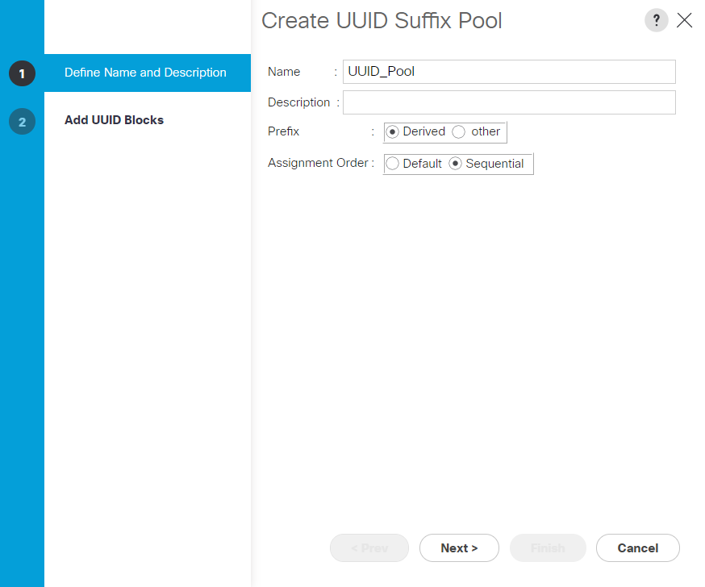

**MAC Pool A — Fabric A addresses:**

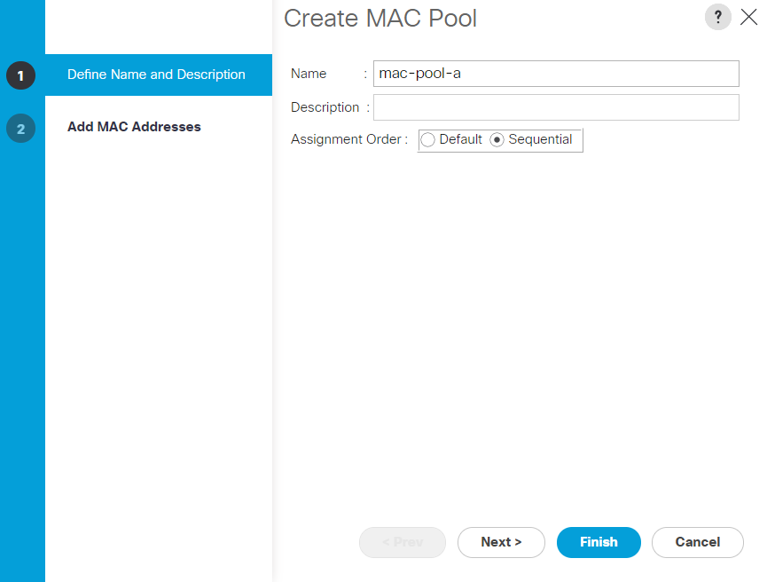

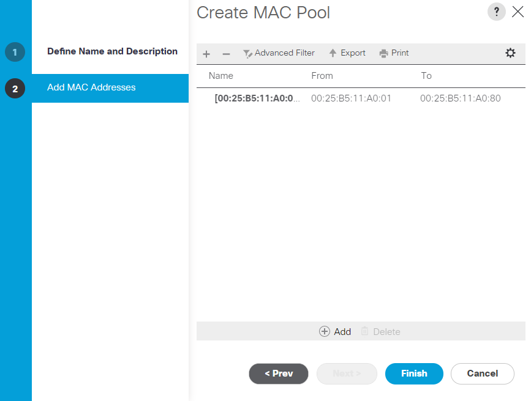

MAC Pool B mirrors this pattern with a distinct B-fabric range so you can always identify
which fabric a MAC belongs to at a glance.

**WWPN Pool — for FC vHBA assignment:**

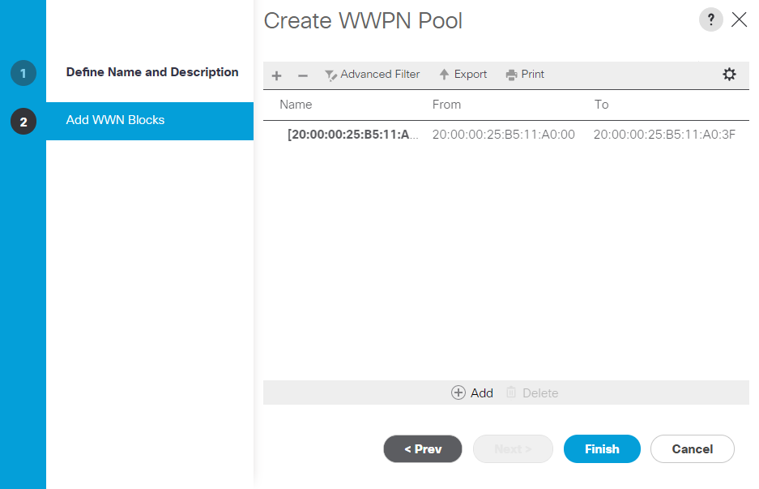

```powershell
# MAC pool — Fabric A (B mirrors with hg-mac-b / B-range)
Add-UcsMacPool -Org $org -Ucs $h -Name 'hg-mac-a' -AssignmentOrder 'sequential' -ModifyPresent
Add-UcsMacMemberBlock -MacPool (Get-UcsMacPool -Ucs $h -Name 'hg-mac-a') -Ucs $h `
    -From '00:25:B5:A0:00:00' -To '00:25:B5:A1:FF:FF' -ModifyPresent

# WWN Node pool — 'node-wwn-assignment' is a creation-time keyword only; cannot be set after creation
Add-UcsWwnPool -Org $org -Ucs $h -Name 'hg-wwnn-pool' `
    -Purpose 'node-wwn-assignment' -AssignmentOrder 'sequential' -ModifyPresent

# WWPN pool — Fabric A
Add-UcsWwnPool -Org $org -Ucs $h -Name 'hg-wwpn-a' `
    -Purpose 'port-wwn-assignment' -AssignmentOrder 'sequential' -ModifyPresent
Add-UcsWwnMemberBlock -WwnPool (Get-UcsWwnPool -Ucs $h -Name 'hg-wwpn-a') -Ucs $h `
    -From '20:00:00:25:B5:A0:00:00' -To '20:00:00:25:B5:A0:00:9F' -ModifyPresent
```

> **Full script** (MAC-A/B, UUID, WWNN, WWPN-A/B, KVM IP pool) →
> [`01-pools.ps1`](https://github.com/humbledgeeks/infra-automation/blob/main/Cisco/UCS/PowerShell/HumbledGeeks/01-pools.ps1)

---

## Step 2 — VLANs and VSANs

**Full script →** [`02-vlans-vsans.ps1`](https://github.com/humbledgeeks/infra-automation/blob/main/Cisco/UCS/PowerShell/HumbledGeeks/02-vlans-vsans.ps1)

VLANs live in the LAN cloud. VSANs **must** be in the **FC Storage Cloud** — not FC Uplink.
Getting this wrong means FC ports will never come up correctly.

**Create VLAN — Common/Global across both fabrics:**

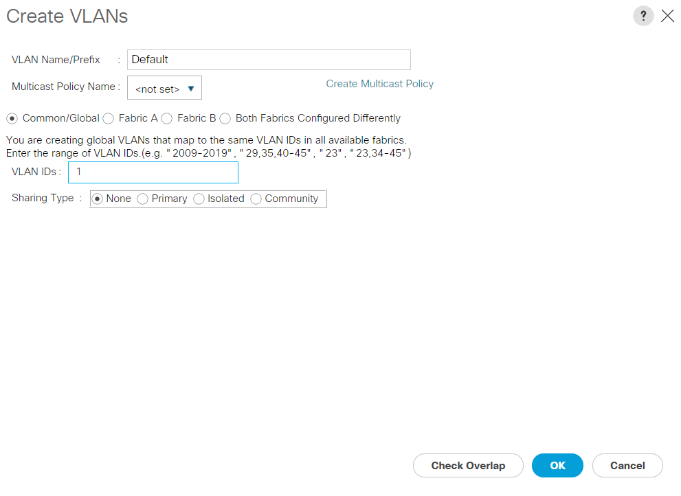

**Create VSAN — Fabric A scoped, VSAN 10, FCoE VLAN 1010:**

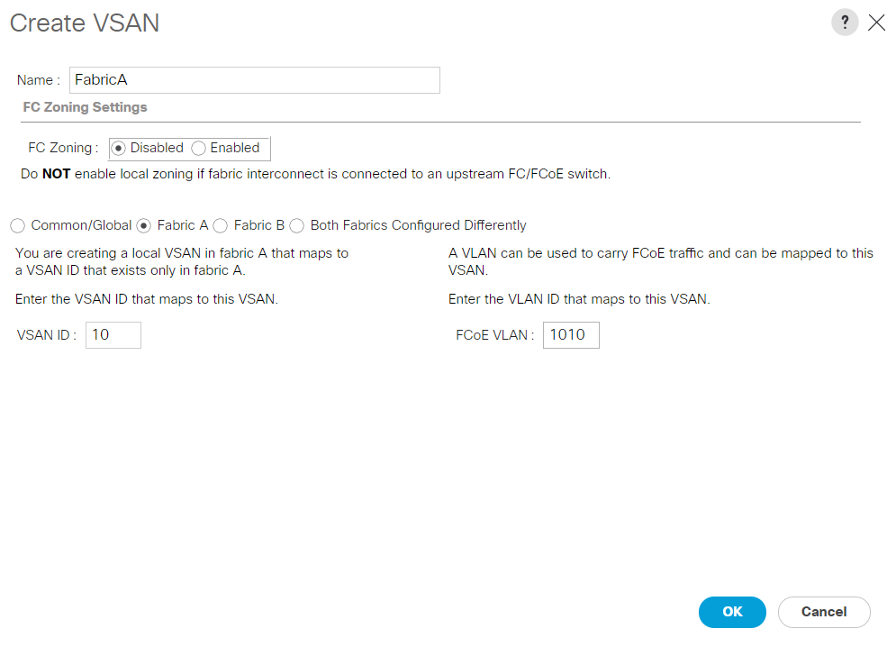

> Notice **FC Zoning: Disabled** — if the FI is connected to an upstream FC/FCoE switch,
> do not enable local zoning. For direct-attach to the ASA A30, zoning is handled at the
> switch level or on the array.

**Port Channel — Fabric A uplinks:**

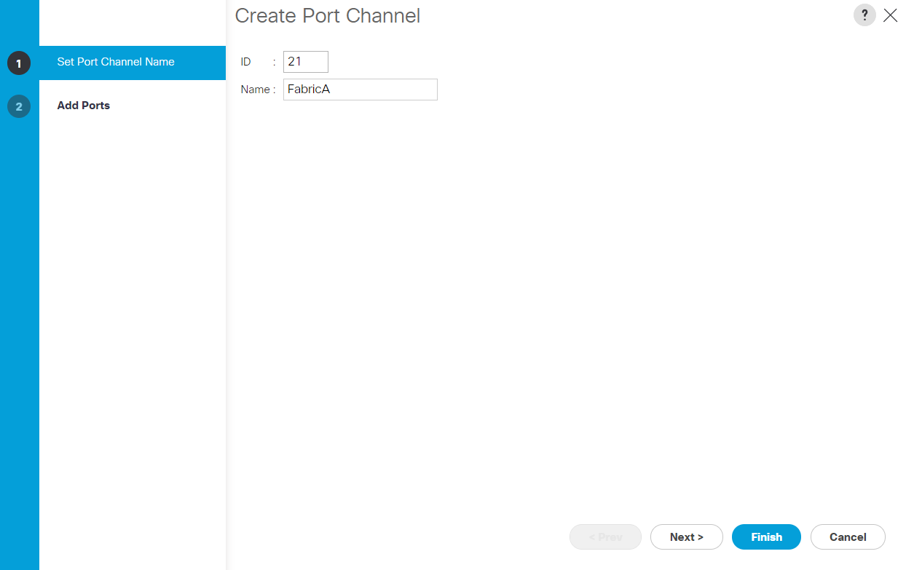

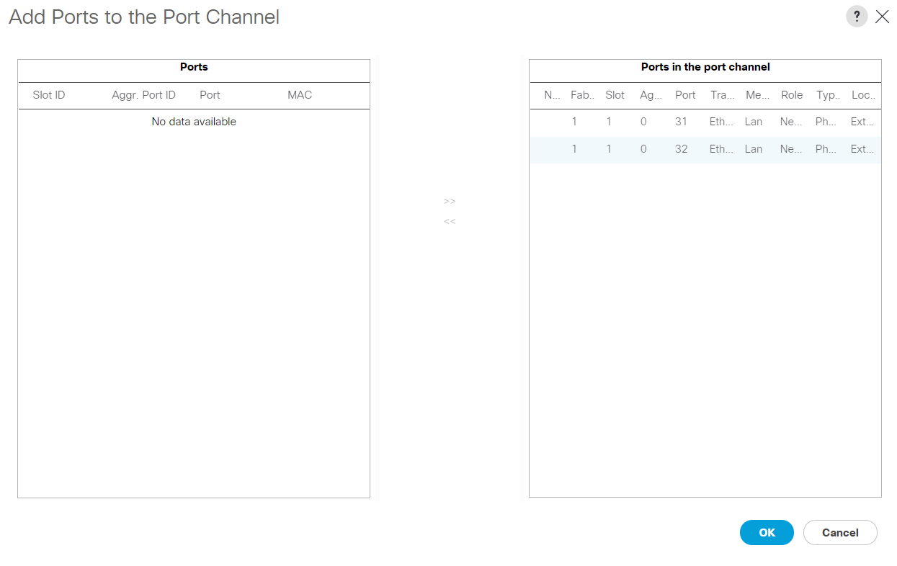

```powershell
# VLAN
Add-UcsVlan -DefaultNet 'no' -Id 16 -Name 'dc3-mgmt' -Ucs $h -ModifyPresent

# VSAN — FC Storage Cloud only. FC Zoning disabled (external switch or array handles zoning)
$vsanA = Add-UcsVsan -Ucs $h -Name 'hg-vsan-a' -Id 10 -FcoeId 1010 `
    -DefaultZoning 'disabled' -ModifyPresent

# FC Storage port member — assigned FROM the VSAN scope, not from the port scope
Add-UcsFabricFcStorageMemberPort -Vsan $vsanA -Ucs $h `
    -FabricId 'A' -SlotId 1 -PortId 29 -ModifyPresent
# Repeat for ports 30–32 and for FabricB / hg-vsan-b

# Ethernet Port Channel — FabricA
$pcA = Add-UcsFabricEthLanPc -Ucs $h -FabricId 'A' -PortId 1 -Name 'FabricA' -ModifyPresent
Add-UcsFabricEthLanPcEp -Ucs $h -LanPc $pcA -SlotId 1 -PortId 17 -ModifyPresent
Add-UcsFabricEthLanPcEp -Ucs $h -LanPc $pcA -SlotId 1 -PortId 18 -ModifyPresent
```

> **Full script** (all 13 VLANs, both VSANs, all FC port members, port channels) →
> [`02-vlans-vsans.ps1`](https://github.com/humbledgeeks/infra-automation/blob/main/Cisco/UCS/PowerShell/HumbledGeeks/02-vlans-vsans.ps1)

---

## Step 3 — Policies

**Full script →** [`03-policies.ps1`](https://github.com/humbledgeeks/infra-automation/blob/main/Cisco/UCS/PowerShell/HumbledGeeks/03-policies.ps1)

### Network Control Policy — CDP and LLDP

The GUI shows CDP as a simple radio button. The **Cisco.UCS PowerShell module does not
expose CDP or LLDP** on `Add-UcsNetworkControlPolicy` — they require a raw XML API call.

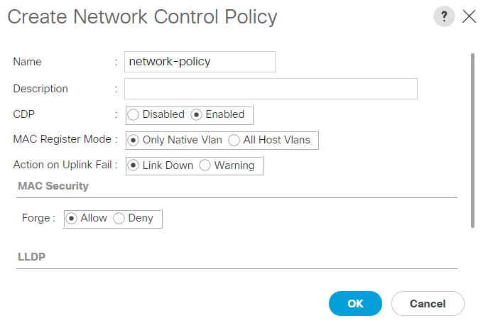

```powershell
$ncp = Add-UcsNetworkControlPolicy -Org $org -Ucs $h `
    -Name 'hg-netcon' -MacRegisterMode 'only-native-vlan' `
    -ForgedTransmit 'deny' -ModifyPresent

# CDP + LLDP — not exposed by module; requires raw XML API
$xml = @"
<configConfMos cookie="$($h.Cookie)" inHierarchical="false">
  <inConfigs><pair key="$($ncp.Dn)">
    <nwctrlDefinition dn="$($ncp.Dn)"
      cdp="enabled" lldpTransmit="enabled" lldpReceive="enabled" status="modified"/>
  </pair></inConfigs>
</configConfMos>
"@
Invoke-UcsXml -Ucs $h -Xml $xml | Out-Null
```

### QoS System Class

The original FlexPod guide sets the Best Effort system class MTU to **9216** when jumbo
frames are required. **In this design, we deliberately leave it at the default (1500).**
Storage is on FC; no Ethernet path requires jumbo frames, and a mismatched MTU anywhere in
a 9000-byte path causes silent packet drops.

```powershell
# MTU 1500 — intentional. Storage is FC; no jumbo frames needed.
Add-UcsQosClass -Ucs $h -Priority 'best-effort' -Mtu 'normal' -ModifyPresent
```

### Local Disk Policy — Any Configuration + FlexFlash

Use `any-configuration` mode — a restrictive mode throws disk config faults on blades whose
local storage doesn't match exactly. Enable FlexFlash so the SD card is visible to the
boot policy.

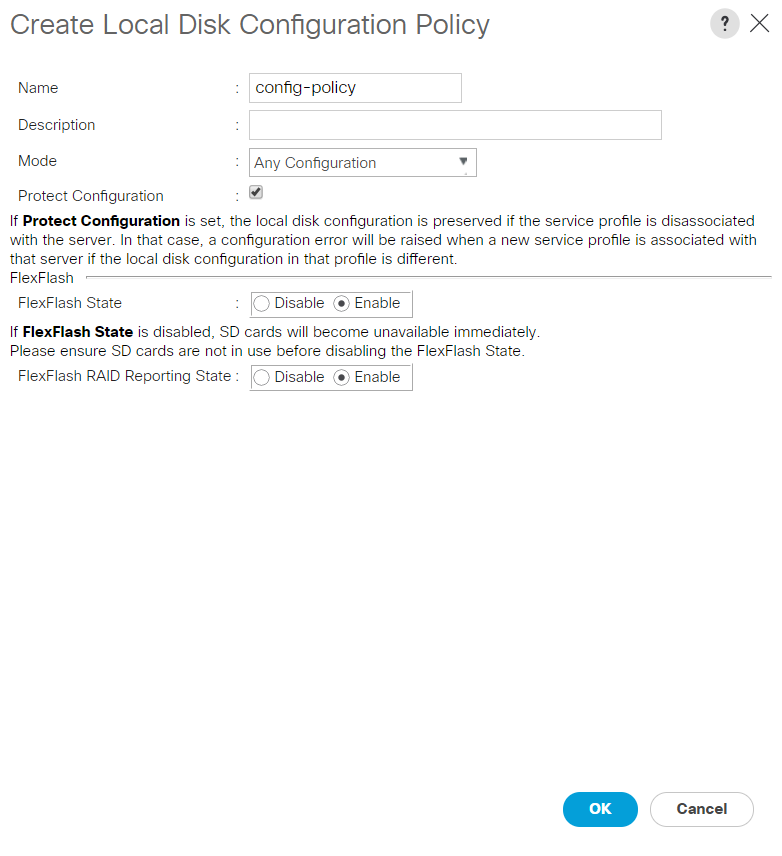

```powershell
Add-UcsLocalDiskConfigPolicy -Org $org -Ucs $h -Name 'hg-local-disk' `
    -Mode 'any-configuration' `
    -FlexFlashState 'enable' -FlexFlashRAIDReportingState 'enable' `
    -ModifyPresent
```

### Maintenance Policy — Always User Ack

Without user-ack, binding an SP to a running blade can trigger an immediate disruptive
reboot. This is the single most important policy to get right before associating.

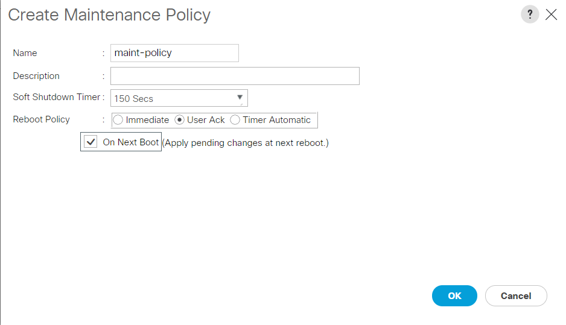

```powershell
Add-UcsMaintenancePolicy -Org $org -Ucs $h -Name 'hg-maint' `
    -UptimeDisr 'user-ack' -DataDisr 'user-ack' `
    -Descr 'User-ack required before disruptive changes' -ModifyPresent
```

### Boot Policy — UEFI, Three-Tier: DVD → SSD → FlexFlash SD

UEFI mode is preferred over Legacy for ESXi on mixed blade generations — it gives
deterministic device order between the M5's internal SSD and the M4's FlexFlash SD card.

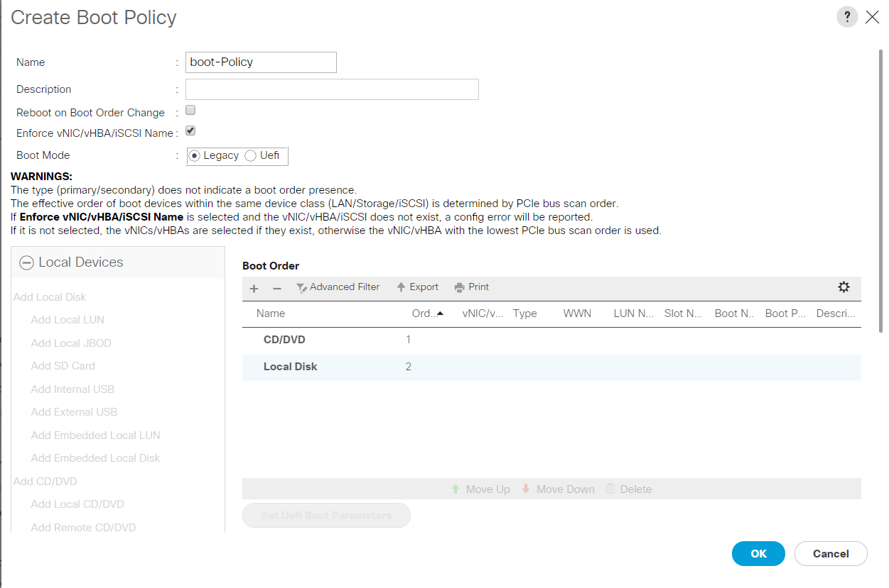

> **UCSM constraint:** Only one `lsbootStorage` container is allowed per boot policy. Both
> SSD (`lsbootEmbeddedLocalDiskImage`) and FlexFlash (`lsbootUsbFlashStorageImage`) must
> live inside the same `storage → local-storage` hierarchy. Boot order numbers are globally
> unique across all nesting levels — see *Hard-Won Lessons* for the full story.

```powershell
$bp = Add-UcsBootPolicy -Org $org -Ucs $h -Name 'hg-flexflash' -BootMode 'uefi' -ModifyPresent
Add-UcsLsBootVirtualMedia -BootPolicy $bp -Ucs $h -Access 'read-only' -Order 1 -ModifyPresent
$bs = Add-UcsLsBootStorage -BootPolicy $bp -Ucs $h -Order 2 -ModifyPresent
$bl = Add-UcsLsBootLocalStorage -BootStorage $bs -Ucs $h -ModifyPresent
Add-UcsLsBootEmbeddedLocalDiskImage -BootLocalStorage $bl -Ucs $h -Order 2 -ModifyPresent  # SSD
Add-UcsLsBootUsbFlashStorageImage   -BootLocalStorage $bl -Ucs $h -Order 3 -ModifyPresent  # FlexFlash SD
```

### Power Control Policy

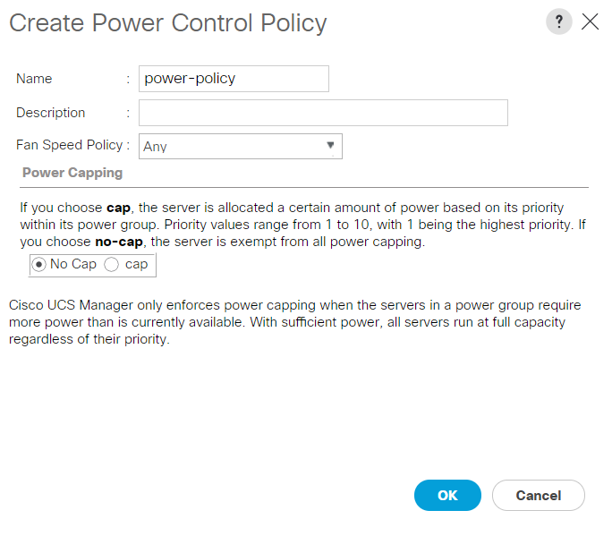

```powershell
Add-UcsPowerPolicy -Org $org -Ucs $h -Name 'hg-power' -Prio 'no-cap' -ModifyPresent
```

### BIOS Policy — VMware Optimized

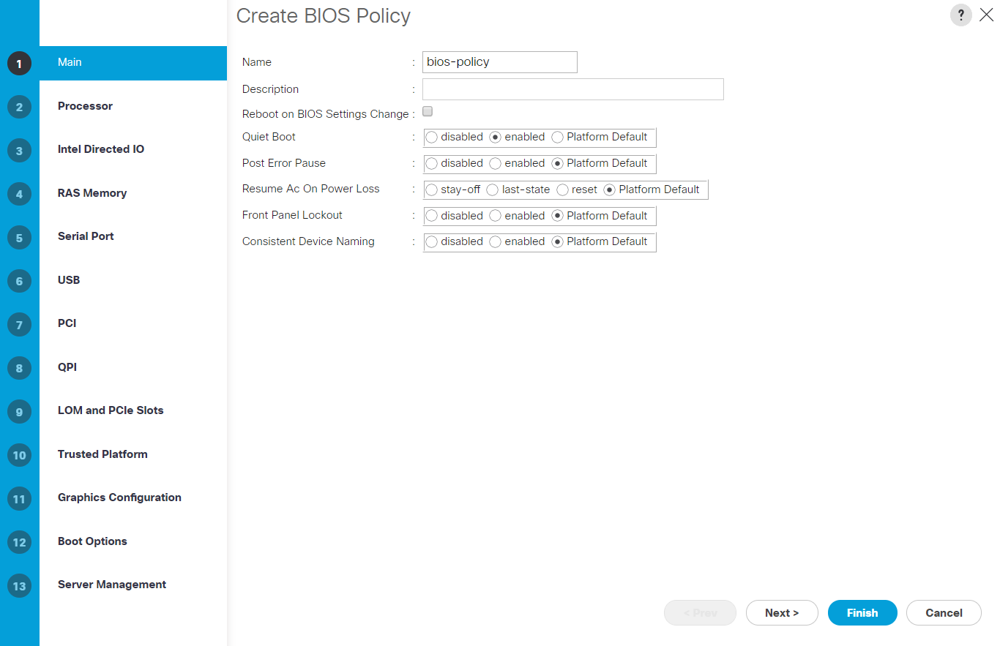

```powershell
$bios = Add-UcsBiosPolicy -Org $org -Ucs $h -Name 'hg-bios' -ModifyPresent
Set-UcsBiosVfIntelVirtualizationTechnology -BiosPolicy $bios -VpIntelVirtualizationTechnology 'enabled' -ModifyPresent
Set-UcsBiosVfIntelVTForDirectedIO         -BiosPolicy $bios -VpIntelVTForDirectedIO 'enabled'            -ModifyPresent
Set-UcsBiosVfCPUPerformance               -BiosPolicy $bios -VpCPUPerformance 'hpc'                      -ModifyPresent
Set-UcsBiosVfProcessorCState              -BiosPolicy $bios -VpProcessorCState 'disabled'                -ModifyPresent
```

### vNIC/vHBA Placement Policy

Controls how vNICs and vHBAs are distributed across physical adapters. Round Robin with
vCon 1 set to Assigned Only ensures vNIC order is consistent across all blades.

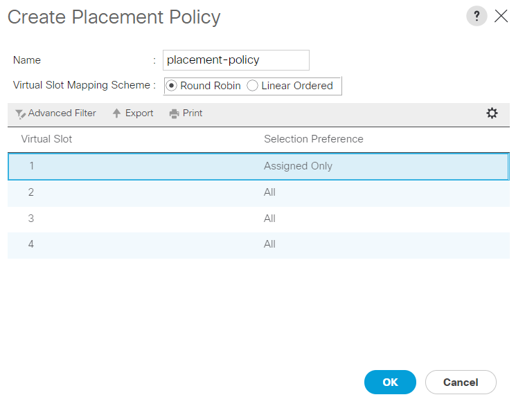

```powershell
$pp = Add-UcsVnicLanConnTempl -Org $org -Ucs $h -Name 'placement-policy' -ModifyPresent
# Placement policy is set at the SP template level via -PlacementPolicyName
```

> **Full script** (all policies above + QoS policy) →
> [`03-policies.ps1`](https://github.com/humbledgeeks/infra-automation/blob/main/Cisco/UCS/PowerShell/HumbledGeeks/03-policies.ps1)

---

## Step 4 — vNIC Templates

**Full script →** [`04-vnic-templates.ps1`](https://github.com/humbledgeeks/infra-automation/blob/main/Cisco/UCS/PowerShell/HumbledGeeks/04-vnic-templates.ps1)

All six templates at MTU 1500 — storage is on FC, no Ethernet storage path, no jumbo frames.

```powershell
# VM workloads trunk — MTU 1500 (block storage runs over FC vHBAs, not Ethernet)
Add-UcsVnicTemplate -Org $org -Ucs $h `
    -Name 'hg-vmnic2' -SwitchId 'A' -TemplType 'updating-template' `
    -IdentPoolName 'hg-mac-a' -Mtu 1500 `
    -NwCtrlPolicyName 'hg-netcon' -QosPolicyName 'hg-qos-be' -ModifyPresent

# VCF overlay / NSX TEP — dedicated pair at MTU 1500
Add-UcsVnicTemplate -Org $org -Ucs $h `
    -Name 'hg-vmnic4' -SwitchId 'A' -TemplType 'updating-template' `
    -IdentPoolName 'hg-mac-a' -Mtu 1500 `
    -NwCtrlPolicyName 'hg-netcon' -QosPolicyName 'hg-qos-be' -ModifyPresent
```

> **Full script** (all 6 templates with VLAN bindings) →
> [`04-vnic-templates.ps1`](https://github.com/humbledgeeks/infra-automation/blob/main/Cisco/UCS/PowerShell/HumbledGeeks/04-vnic-templates.ps1)

---

## Step 5 — vHBA Templates

**Full script →** [`05-vhba-templates.ps1`](https://github.com/humbledgeeks/infra-automation/blob/main/Cisco/UCS/PowerShell/HumbledGeeks/05-vhba-templates.ps1)

Two FC vHBAs — one path per fabric — give true dual-path to the NetApp ASA A30.

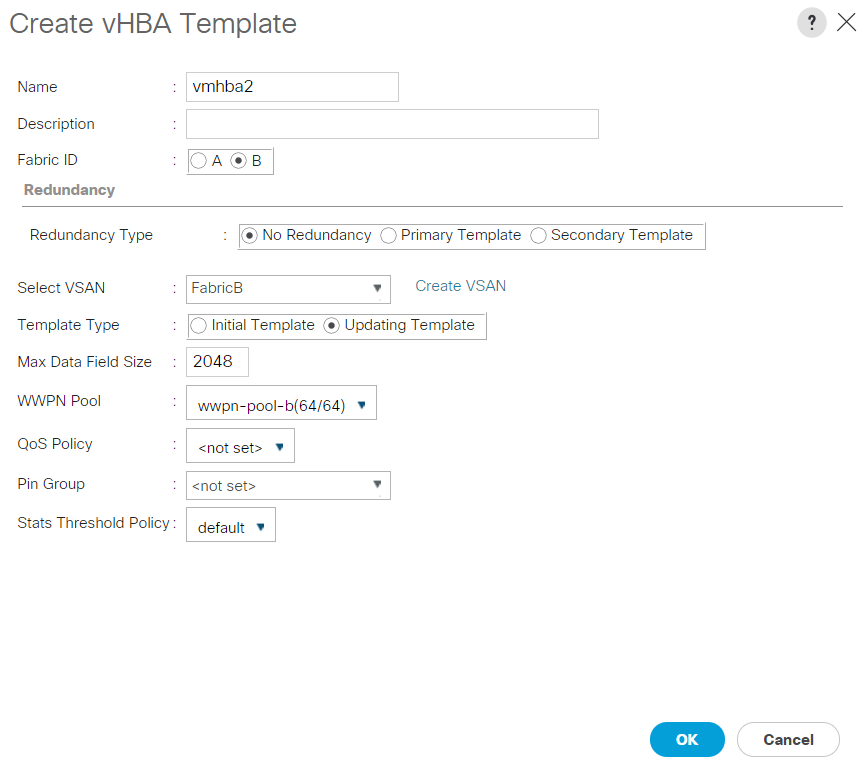

```powershell
$vhbaA = Add-UcsVhbaTemplate -Org $org -Ucs $h `
    -Name 'hg-vmhba0' -SwitchId 'A' -TemplType 'updating-template' `
    -IdentPoolName 'hg-wwpn-a' -MaxDataFieldSize 2048 `
    -QosPolicyName 'hg-qos-be' -ModifyPresent

# Bind VSAN to the template
Add-UcsVhbaInterface -VhbaTemplate $vhbaA -Ucs $h -Name 'hg-vsan-a' -ModifyPresent
```

> **Full script** (both vHBAs, VSAN binding) →
> [`05-vhba-templates.ps1`](https://github.com/humbledgeeks/infra-automation/blob/main/Cisco/UCS/PowerShell/HumbledGeeks/05-vhba-templates.ps1)

---

## Step 6 — Service Profile Template

**Full script →** [`06-service-profile-template.ps1`](https://github.com/humbledgeeks/infra-automation/blob/main/Cisco/UCS/PowerShell/HumbledGeeks/06-service-profile-template.ps1)

The SP template ties everything together. Template type **must** be `updating-template` —
it cannot be changed in-place after creation (delete and recreate if you get it wrong).

**Step 1 — Identity:** Name, Updating Template, UUID pool:

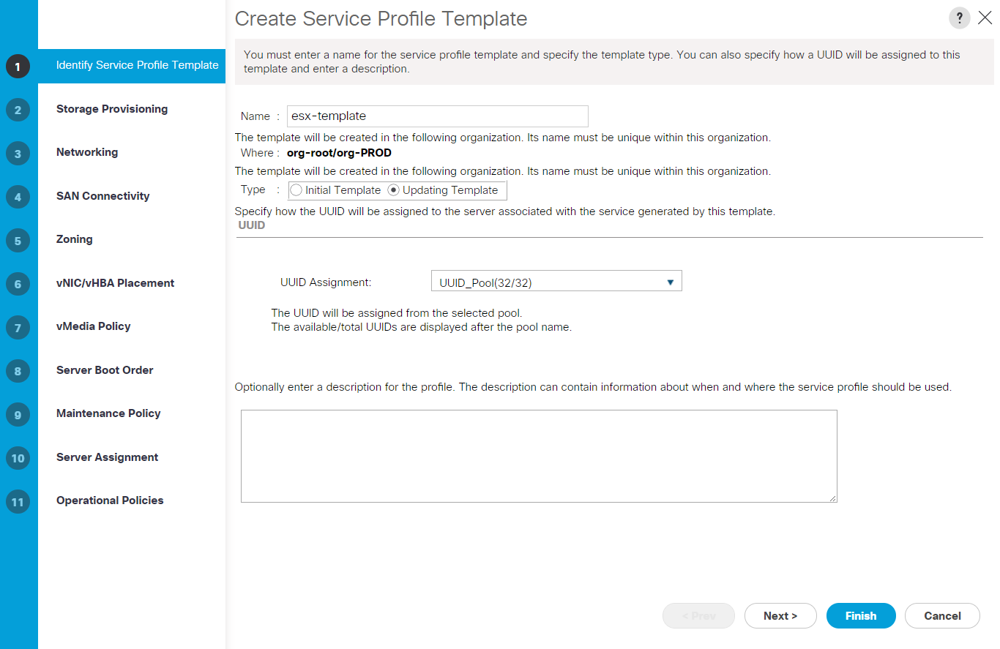

**Step 3 — Networking:** Six vNICs bound to templates, VMware adapter policy:

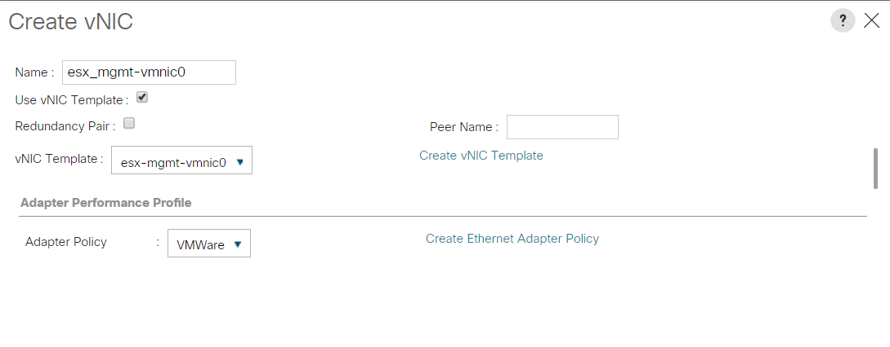

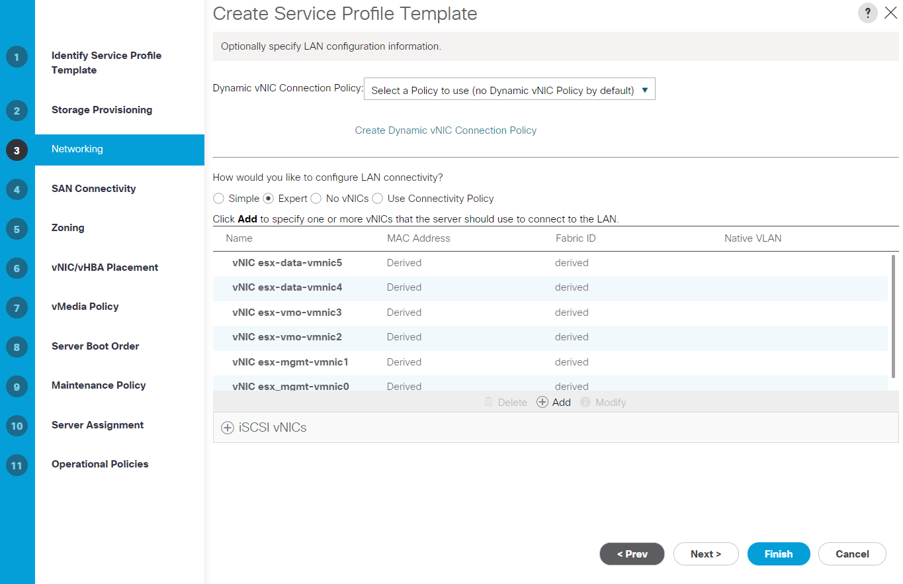

**Step 4 — SAN Connectivity:** vHBAs bound to templates with VMware FC adapter policy:

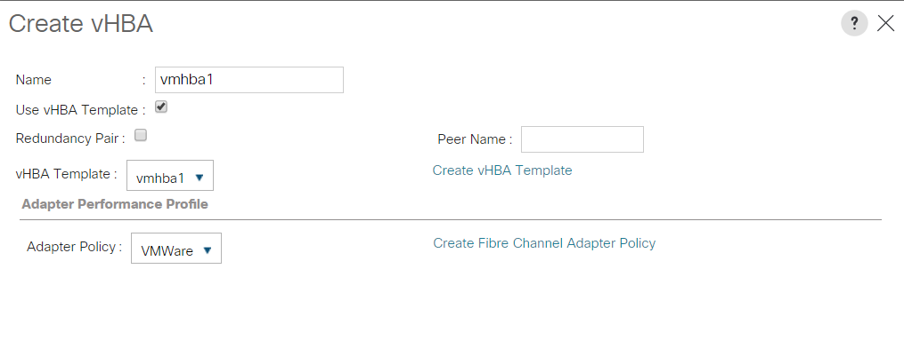

**Step 8 — Server Boot Order:** Boot policy assigned:

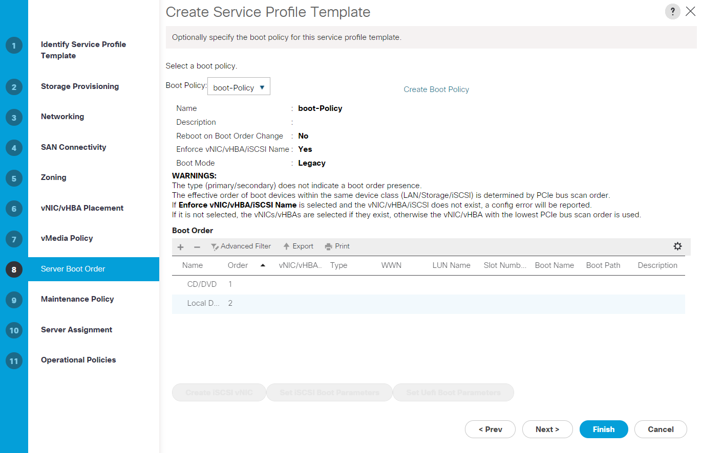

**Step 11 — Operational Policies:** BIOS, Management IP (KVM), Power, and Scrub:

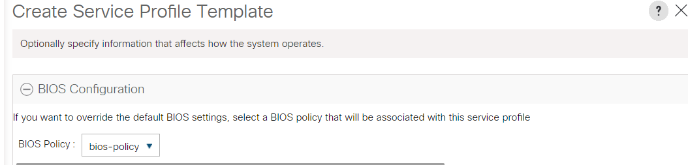

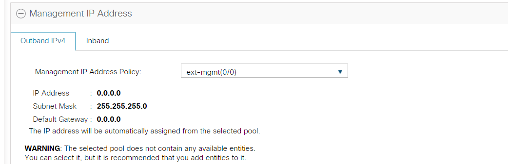

```powershell
$spt = Add-UcsServiceProfile -Org $org -Ucs $h `
    -Name              'hg-esx-template' `
    -Type              'updating-template' `
    -UuidPoolName      'hg-uuid-pool' `
    -BootPolicyName    'hg-flexflash' `
    -MaintPolicyName   'hg-maint' `
    -LocalDiskPolicyName 'hg-local-disk' `
    -BiosProfileName   'hg-bios' `
    -PowerPolicyName   'hg-power' `
    -Descr             'FlexPod VCF ESXi template — hg-esx-template' `
    -ModifyPresent

# Bind vNICs in template order (vmnic0-5, orders 1-6)
$order = 1
foreach ($tpl in @('hg-vmnic0','hg-vmnic1','hg-vmnic2','hg-vmnic3','hg-vmnic4','hg-vmnic5')) {
    Add-UcsVnic -ServiceProfile $spt -Ucs $h `
        -Name "vmnic$($order-1)" -NwTemplName $tpl `
        -AdaptorProfileName 'VMWare' -Order $order -ModifyPresent | Out-Null
    $order++
}

# Bind vHBAs (vmhba0-1, orders 7-8)
Add-UcsVhba -ServiceProfile $spt -Ucs $h `
    -Name 'vmhba0' -NwTemplName 'hg-vmhba0' `
    -AdaptorProfileName 'VMWare' -Order 7 -ModifyPresent | Out-Null
Add-UcsVhba -ServiceProfile $spt -Ucs $h `
    -Name 'vmhba1' -NwTemplName 'hg-vmhba1' `
    -AdaptorProfileName 'VMWare' -Order 8 -ModifyPresent | Out-Null

# KVM management IP pool
Add-UcsVnicIpV4PooledIscsiAddr -ServiceProfile $spt -Ucs $h `
    -PoolName 'hg-ext-mgmt' -ModifyPresent | Out-Null
```

> **Full script** →
> [`06-service-profile-template.ps1`](https://github.com/humbledgeeks/infra-automation/blob/main/Cisco/UCS/PowerShell/HumbledGeeks/06-service-profile-template.ps1)

---

## Step 7 — Deploy Service Profiles

**Full script →** [`07-deploy-service-profiles.ps1`](https://github.com/humbledgeeks/infra-automation/blob/main/Cisco/UCS/PowerShell/HumbledGeeks/07-deploy-service-profiles.ps1)

```powershell
# Derive 8 SPs from the template and associate to blades
1..8 | ForEach-Object {
    $sp = Add-UcsServiceProfile -Org $org -Ucs $h `
        -Name "hg-esx-0$_" -SrcTemplName 'hg-esx-template' -ModifyPresent
    Add-UcsLsBinding -ServiceProfile $sp -Ucs $h `
        -PnDn "sys/chassis-1/blade-$_" -ModifyPresent | Out-Null
}
```

Because `hg-maint` is set to user-ack, UCSM **will not reboot blades immediately** —
acknowledge the pending change in the GUI or via PowerShell:

```powershell
Get-UcsLsmaintAck -Ucs $h | Where-Object { $_.AdminState -eq 'trigger-immediate' } |
    Set-UcsLsmaintAck -AdminState 'trigger-immediate' -Force
```

> **Full script** →
> [`07-deploy-service-profiles.ps1`](https://github.com/humbledgeeks/infra-automation/blob/main/Cisco/UCS/PowerShell/HumbledGeeks/07-deploy-service-profiles.ps1)

---

## Step 8 — Admin Configuration (NTP and DNS)

**Full script →** [`03-policies.ps1`](https://github.com/humbledgeeks/infra-automation/blob/main/Cisco/UCS/PowerShell/HumbledGeeks/03-policies.ps1)
*(NTP and DNS are included in the policies script)*

Don't skip NTP. UCSM uses timestamps for fault correlation, syslog, and certificate
validation — a drifting clock causes subtle issues that are hard to trace back to time skew.

```powershell
# NTP — set timezone and add servers
$tz = Get-UcsTimezone -Ucs $h
Set-UcsTimezone -Timezone $tz -AdminState 'enabled' -Timezone 'America/Los_Angeles' -Force
Add-UcsNtpServer -Ucs $h -Name '10.x.x.x' -ModifyPresent  # primary NTP
Add-UcsNtpServer -Ucs $h -Name '10.x.x.x' -ModifyPresent  # secondary NTP

# DNS
Add-UcsDnsServer -Ucs $h -Name '10.x.x.x' -ModifyPresent  # primary DNS
Add-UcsDnsServer -Ucs $h -Name '10.x.x.x' -ModifyPresent  # secondary DNS
```

---

## Step 9 — Verify

**Full script →** [`08-verify.ps1`](https://github.com/humbledgeeks/infra-automation/blob/main/Cisco/UCS/PowerShell/HumbledGeeks/08-verify.ps1)

```powershell
# Faults
Get-UcsFault -Ucs $h | Where-Object { $_.Severity -ne 'cleared' } |
    Select-Object Severity, Code, Descr | Format-Table -AutoSize

# SP association state
Get-UcsServiceProfile -Ucs $h -Org $org |
    Select-Object Name, AssocState, PnDn | Format-Table -AutoSize

# Port channel state
Get-UcsFabricEthLanPc -Ucs $h |
    Select-Object Dn, OperState, Bandwidth | Format-Table -AutoSize
```

> **Full script** →
> [`08-verify.ps1`](https://github.com/humbledgeeks/infra-automation/blob/main/Cisco/UCS/PowerShell/HumbledGeeks/08-verify.ps1)

---

## Hard-Won UCSM Lessons

**Boot policy RN gets a mandatory prefix.** Name it `hg-flexflash` and UCSM stores it as
`boot-policy-hg-flexflash`. Hardcoding the wrong DN in XML API calls produces silent
failures. Always probe with `configResolveClass lsbootPolicy` first.

**Only one `lsbootStorage` container per boot policy.** UCSM silently discards any second
storage container you try to create. All local boot devices — SSD and SD card — must live
inside the same `storage → local-storage` hierarchy, ordered by their `order` attribute.
Boot order numbers are globally unique across all nesting levels.

**CDP and LLDP are not exposed by the Cisco.UCS PowerShell module.** The correct attributes
on `nwctrlDefinition` are `cdp`, `lldpTransmit`, and `lldpReceive`. Use `Invoke-UcsXml`
with a raw `configConfMos` payload.

**UCSM silently drops unknown XML attributes and returns HTTP 200.** Always verify with a
`configResolveDn` query after any XML API write. This bit us on the maintenance policy —
`rebootPolicy` is not valid; the correct attributes are `uptimeDisr` and `dataDisr`.

**VSANs belong in the FC Storage Cloud, not FC Uplink.** FC port VSAN membership is also
assigned *from* the VSAN scope, not from the port scope.

**WWN pool purpose is a creation-time keyword.** You cannot set `node-wwn-assignment` after
a pool is created — delete and recreate if you get it wrong.

**SP template type cannot be changed in-place.** `updating-template` vs `instance` is set
at creation only.

**The QoS system class MTU matters.** The original FlexPod guide sets Best Effort to 9216
for NFS/iSCSI paths. In this design it stays at the default because storage is on FC and no
Ethernet path needs jumbo frames. Always match this setting to your actual traffic profile.

---

## As-Built Final State

```
Faults           : 0 unacknowledged active faults
Blades           : 8/8 present (1× B200-M5, 7× B200-M4), 0 associated
Port Channels    : PC1 UP (FI-A, ports 17+18, 10 Gbps)
                   PC2 UP (FI-B, ports 17+18, 10 Gbps)
VSANs            : hg-vsan-a (ID 10, FCoE 1010) — 4 FC storage port members
                   hg-vsan-b (ID 11, FCoE 1011) — 4 FC storage port members

SP Template      : hg-esx-template (updating-template)
  UUID Pool      : hg-uuid-pool (sequential)
  Boot Policy    : hg-flexflash → UEFI: DVD(1) SSD(2) FlexFlash(3)
  Maint Policy   : hg-maint → uptimeDisr=user-ack, dataDisr=user-ack
  Local Disk     : hg-local-disk → any-configuration, FlexFlash enabled
  BIOS Policy    : hg-bios → VT-x, VT-d, C-States off, Perf=HPC
  Power Policy   : hg-power → no-cap
  KVM IP Pool    : hg-ext-mgmt (sequential, 9 addresses)
  vNICs          : vmnic0–5 all MTU 1500
  vHBAs          : vmhba0 (FA, VSAN 10) + vmhba1 (FB, VSAN 11)

NetCtrl hg-netcon: cdp=enabled, lldpTransmit=enabled, lldpReceive=enabled
Storage target   : NetApp ASA A30 — FC direct attach, FI storage ports 29–32
```

---

## Recommendations

**Add a firmware management policy before associating blades.**
On a mixed M4/M5 fleet, ensure the host firmware package covers both blade generations.

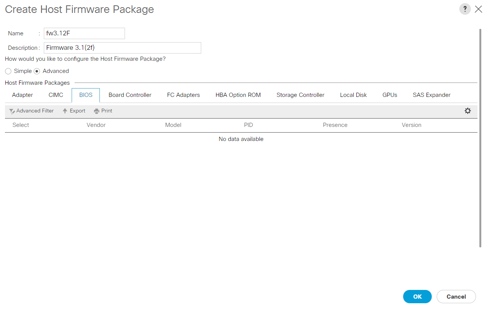

```powershell
Add-UcsFirmwareComputeHostPack -Org $org -Ucs $h `
    -Name 'hg-fw' -BladeBundleVersion '4.2(3e)' -ModifyPresent
```

**Consider a scrub policy for lab teardowns.**
Disk + BIOS + FlexFlash scrub on disassociation avoids stale ESXi installs on SD cards
between rebuilds.

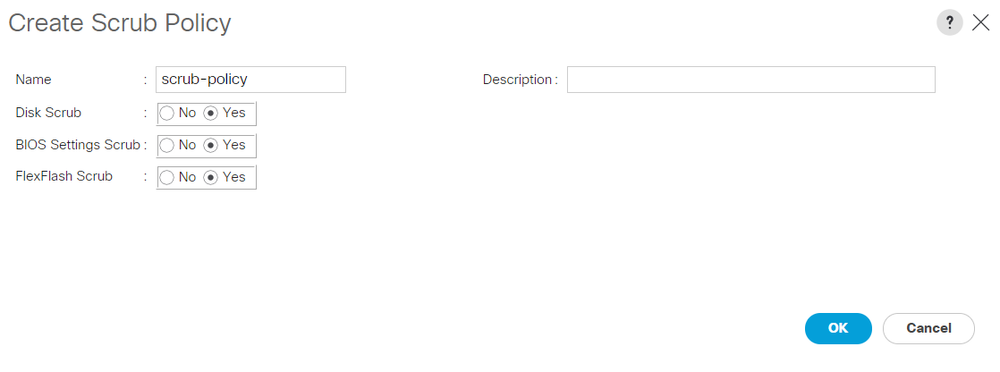

```powershell
Add-UcsScrubPolicy -Org $org -Ucs $h -Name 'hg-scrub' `
    -DiskScrub 'yes' -BiosSettingsScrub 'yes' -FlexFlashScrub 'yes' -ModifyPresent
```

**Separate pool ranges per fabric.** Non-overlapping MAC and WWPN ranges let you immediately
identify which fabric a path belongs to during storage troubleshooting.

**Sequential assignment everywhere.** After a full teardown/rebuild, blade-1 always gets
the same identity from every pool — predictable for IPAM, IPMI, and storage zoning.

**Check the FlexPod CVDs for your specific versions.**
[NetApp FlexPod for VMware VCF](https://www.netapp.com/data-storage/flexpod/) and
[Cisco's FlexPod Design Zone](https://www.cisco.com/c/en/us/solutions/design-zone/networking-design-guides/flexpod.html)
publish validated designs updated for every major VCF and ONTAP release. Always cross-check
your firmware matrix against the CVD for your target versions.

---

## What's Next

This post covers the UCS foundation. The follow-up will walk through deploying
**Broadcom VCF 5.x** on top — four blades for the management domain (vCenter, NSX,
SDDC Manager) and four blades for the first VI workload domain, with the
[NetApp ASA A30](https://www.netapp.com/data-storage/asa/) providing FC block storage
datastores to both domains.

1. **FC Zoning** — Zone each ESXi initiator WWPN to the ASA A30 target ports per fabric
2. **ESXi staging** — Mount ISO to virtual KVM DVD or configure PXE on dc3-mgmt (VLAN 16)
3. **Associate SPs** — Run `07-deploy-service-profiles.ps1`; acknowledge user-ack pending changes
4. **VCF bringup** — SDDC Manager Cloud Builder handles domain deployment; KVM IPs from `hg-ext-mgmt` become host management IPs in the deployment JSON

---

## Get the Code

```
https://github.com/humbledgeeks/infra-automation
└── Cisco/UCS/PowerShell/HumbledGeeks/
    ├── 00-prereqs-and-connect.ps1
    ├── 01-pools.ps1
    ├── 02-vlans-vsans.ps1
    ├── 03-policies.ps1          ← includes NTP, DNS, all policies
    ├── 04-vnic-templates.ps1
    ├── 05-vhba-templates.ps1
    ├── 06-service-profile-template.ps1
    ├── 07-deploy-service-profiles.ps1
    ├── 08-verify.ps1
    └── screenshots/             ← all UCSM GUI screenshots referenced above
```

---

*Questions or found a cleaner way to handle the boot policy singleton constraint or VSAN
binding? Open an issue or find us on the HumbledGeeks Discord.*

*Vendor links: [Cisco UCS](https://www.cisco.com/c/en/us/products/servers-unified-computing/index.html)
· [NetApp FlexPod](https://www.netapp.com/data-storage/flexpod/)
· [NetApp ASA](https://www.netapp.com/data-storage/asa/)
· [Broadcom VCF](https://www.broadcom.com/products/software/vmware)*
